# Diagrammi dell'Architettura di Sistema

**Stato del Documento:** 🟢 Completo
**Ultimo Aggiornamento:** 2025-11-10
**Autore:** Kilo Code

## Indice

1. [Panoramica](#panoramica)
2. [Architettura di Sistema ad Alto Livello](#architettura-di-sistema-ad-alto-livello)
3. [Diagramma dei Componenti](#diagramma-dei-componenti)
4. [Flusso del Motore di Ragionamento](#flusso-del-motore-di-ragionamento)
5. [Architettura del Sistema di Memoria](#architettura-del-sistema-di-memoria)
6. [Flusso di Esecuzione degli Strumenti](#flusso-di-esecuzione-degli-strumenti)
7. [Ciclo di Vita delle Richieste](#ciclo-di-vita-delle-richieste)
8. [Diagramma di Flusso dei Dati](#diagramma-di-flusso-dei-dati)
9. [Architettura di Deployment](#architettura-di-deployment)

---

## Panoramica

Questo documento fornisce rappresentazioni visive dell'architettura dell'agente ideale utilizzando diagrammi Mermaid. Questi diagrammi completano le specifiche tecniche presenti negli altri documenti.

---

## Architettura di Sistema ad Alto Livello

### Contesto del Sistema

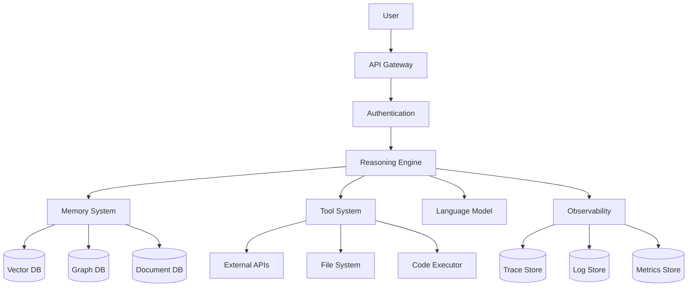

### Componenti Principali

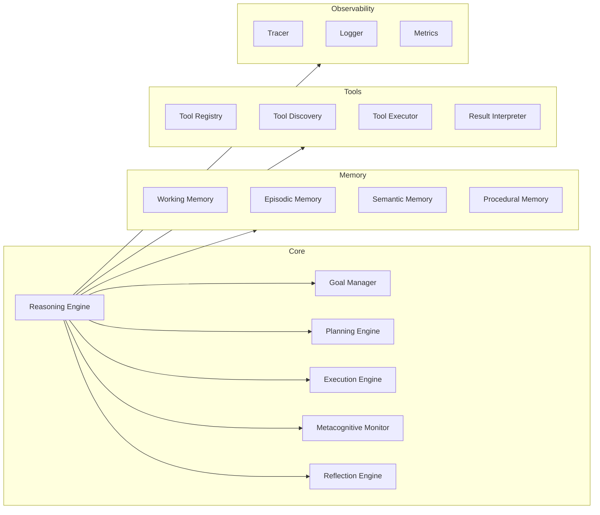

---

## Diagramma dei Componenti

### Vista Dettagliata dei Componenti

```mermaid
graph TB
    subgraph Presentation Layer
        UI[User Interface]
        API[REST API]
        WebSocket[WebSocket API]
    end

    subgraph Application Layer
        subgraph Reasoning
            GoalMgr[Goal Manager]
            Planner[Planning Engine]
            Executor[Execution Engine]
            Monitor[Metacognitive Monitor]
            Reflector[Reflection Engine]
        end

        subgraph Orchestration
            ToolRegistry[Tool Registry]
            ToolExecutor[Tool Executor]
            ParamBinder[Parameter Binder]
        end
    end

    subgraph Data Layer
        WorkingMem[Working Memory]

        subgraph Long-term
            EpisodicDB[(Episodic DB)]
            SemanticDB[(Semantic DB)]
            ProceduralDB[(Procedural DB)]
            VectorDB[(Vector DB)]
        end
    end

    subgraph Infrastructure
        LLMProvider[LLM Provider]
        Observability[Observability Stack]
        Security[Security Layer]
    end

    UI --> API
    API --> GoalMgr
    GoalMgr --> Planner
    Planner --> Executor
    Executor --> ToolRegistry
    Executor --> Monitor
    Monitor --> Reflector

    Reasoning --> WorkingMem
    Reasoning --> Long-term
    Reasoning --> LLMProvider

    ToolExecutor --> LLMProvider

    Application Layer --> Security
    Application Layer --> Observability
```

---

## Flusso del Motore di Ragionamento

### Ciclo Decisionale

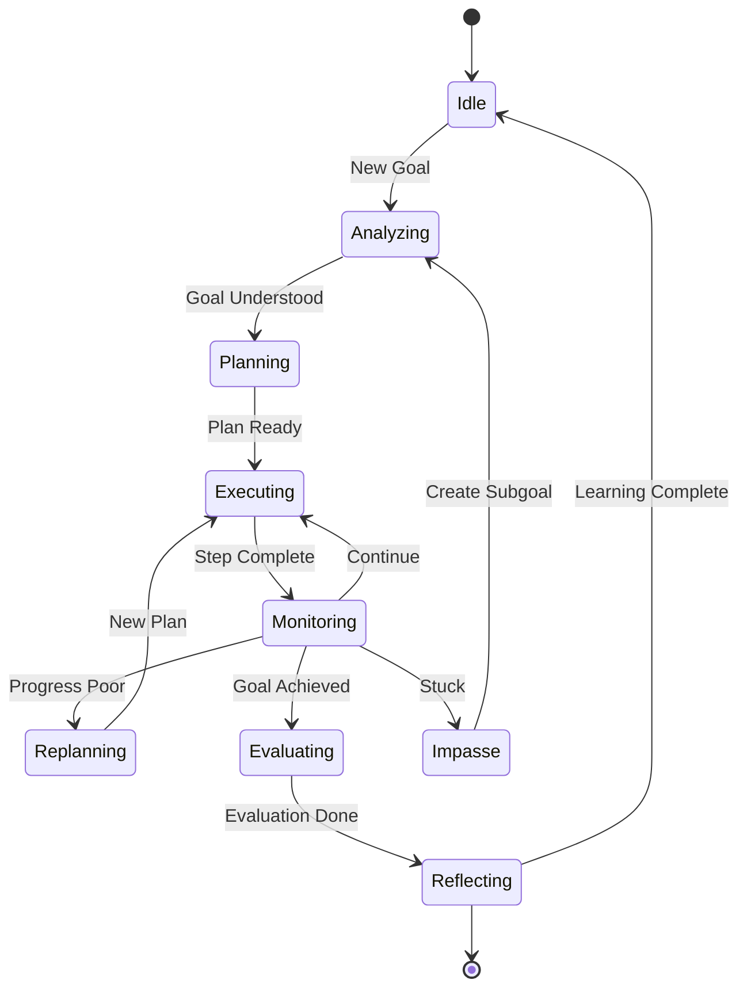

### Sequenza del Loop di Ragionamento

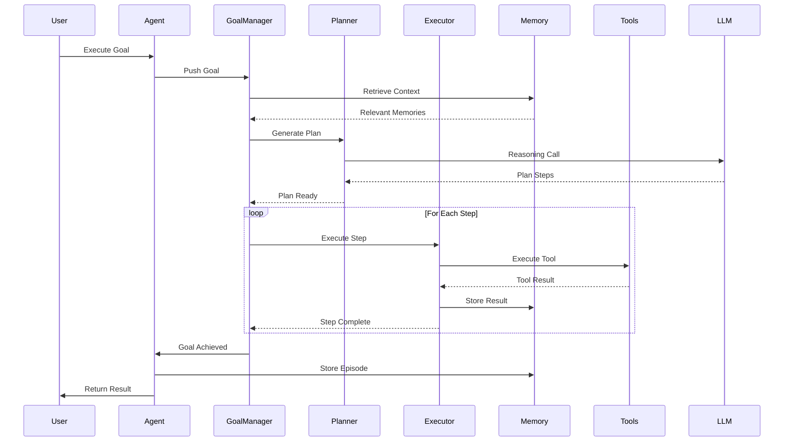

---

## Architettura del Sistema di Memoria

### Gerarchia della Memoria

```mermaid
graph TB
    subgraph Working Memory
        Context[Context Window<br/>8K-128K tokens]
        Goals[Active Goals]
        Recent[Recent Observations]
    end

    subgraph Retrieval Engine
        Activation[Activation<br/>Computation]
        Similarity[Similarity<br/>Search]
        Spreading[Spreading<br/>Activation]
    end

    subgraph Long-term Storage
        Episodic[(Episodic<br/>Document DB)]
        Semantic[(Semantic<br/>Graph DB)]
        Procedural[(Procedural<br/>Template Store)]
        Vector[(Vector DB<br/>Embeddings)]
    end

    Working Memory --> Retrieval Engine
    Retrieval Engine --> Long-term Storage

    Long-term Storage --> Consolidation[Consolidation<br/>Process]
    Consolidation --> Long-term Storage
```

### Flusso delle Operazioni di Memoria

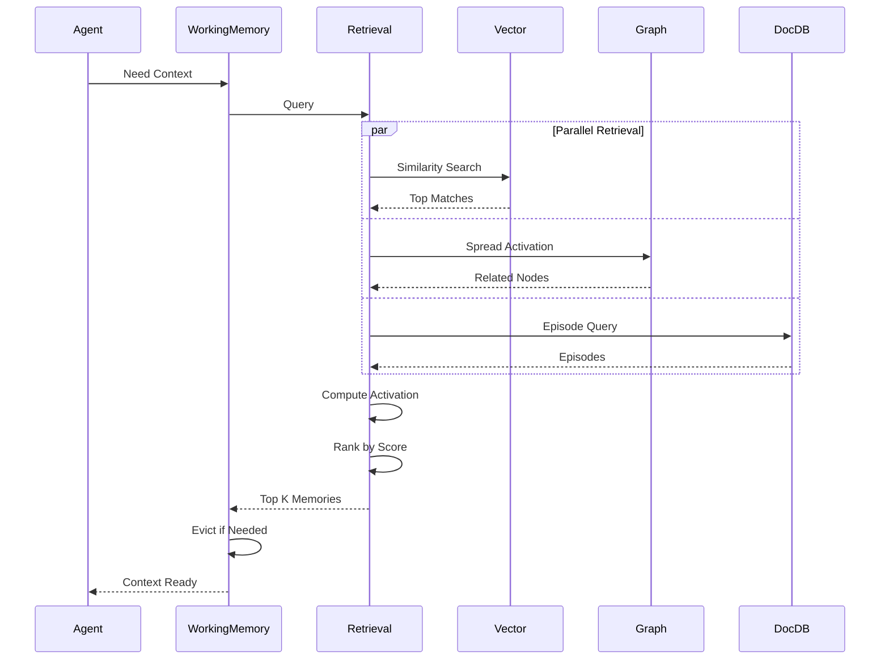

---

## Flusso di Esecuzione degli Strumenti

### Ciclo di Vita degli Strumenti

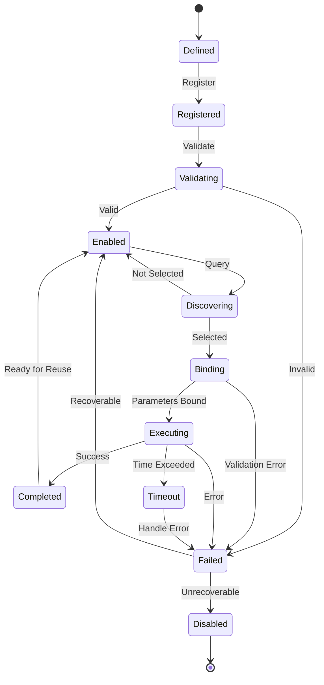

### Sequenza di Esecuzione degli Strumenti

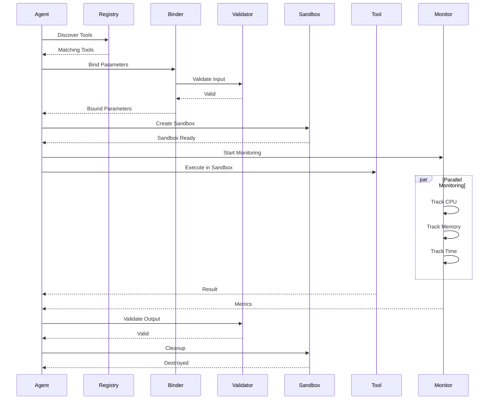

---

## Ciclo di Vita delle Richieste

### Flusso di Richiesta End-to-End

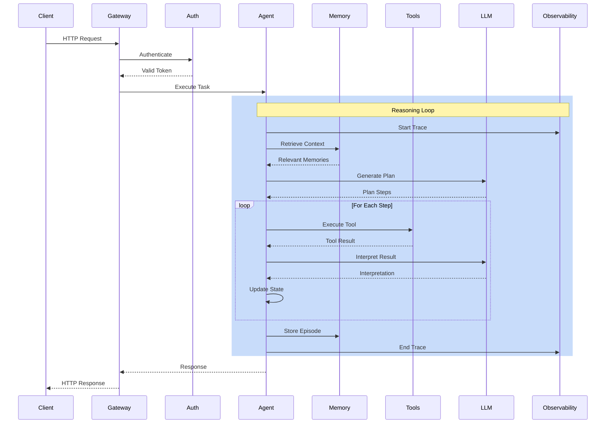

---

## Diagramma di Flusso dei Dati

### Flusso delle Informazioni

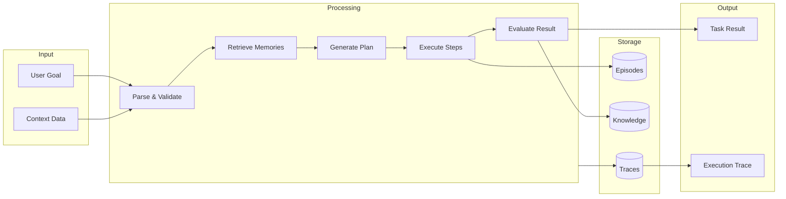

### Trasformazioni dei Dati

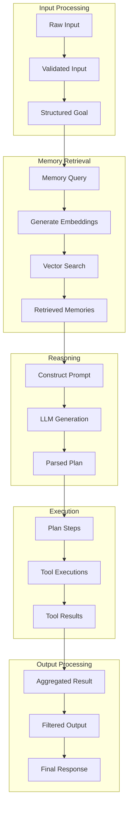

---

## Architettura di Deployment

### Deployment di Produzione

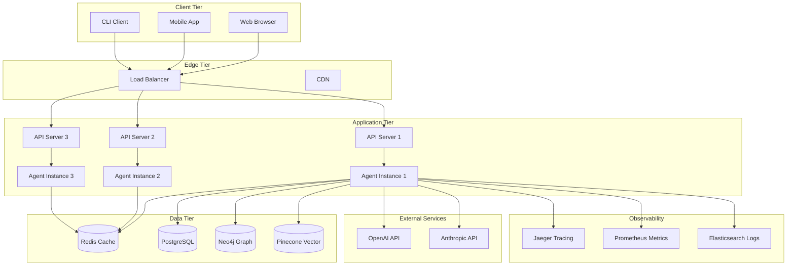

### Architettura dei Container

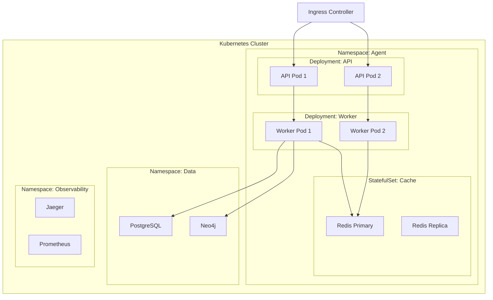

---

## Flusso del Motore di Ragionamento

### Dettaglio del Loop Principale

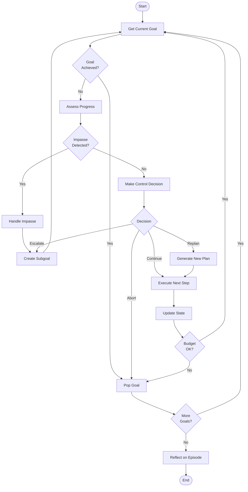

### Processo di Pianificazione

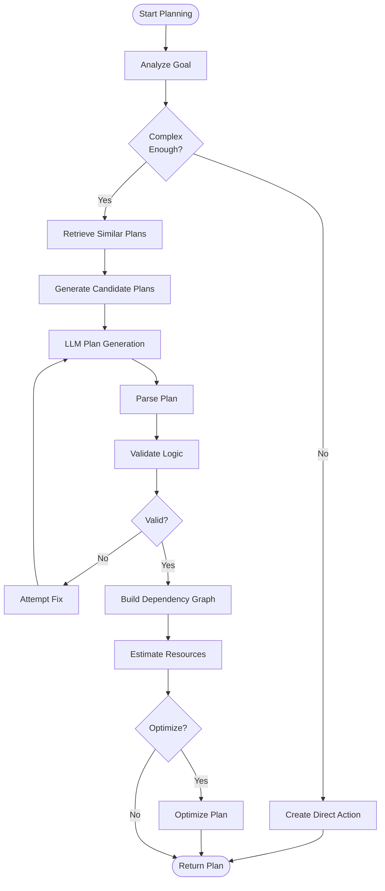

---

## Architettura del Sistema di Memoria

### Processo di Recupero

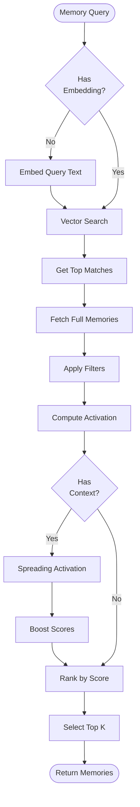

### Processo di Consolidamento

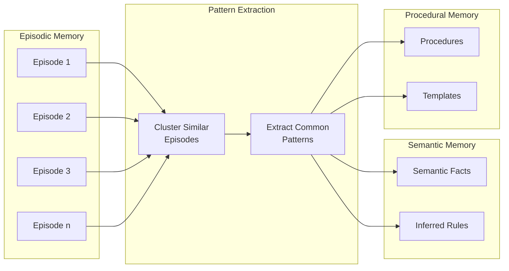

---

## Flusso di Esecuzione degli Strumenti

### Sequenza di Chiamata degli Strumenti

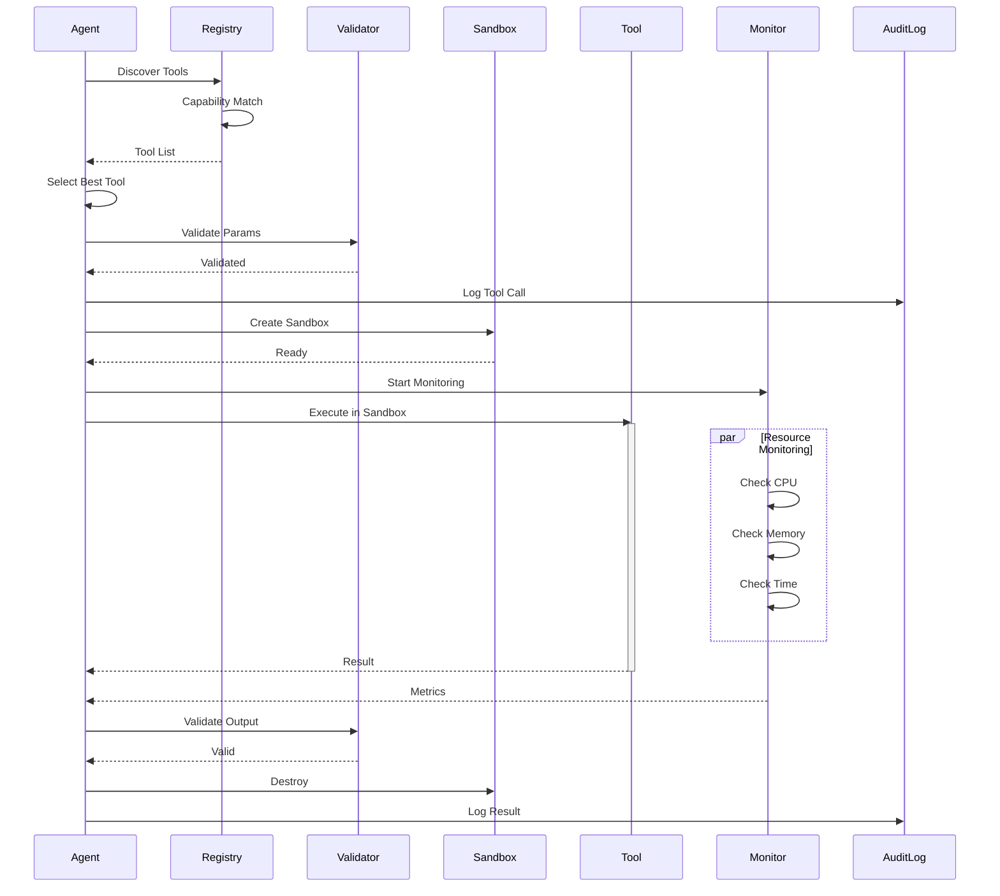

---

## Ciclo di Vita delle Richieste

### Flusso Completo delle Richieste

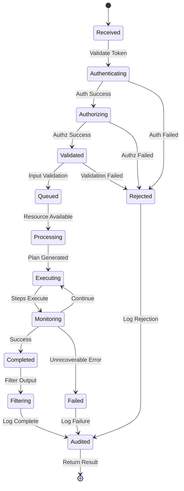

---

## Diagramma di Flusso dei Dati

### Flusso delle Informazioni attraverso il Sistema

```mermaid
graph LR
    subgraph External
        User[User Input]
        APIs[External APIs]
        Files[File System]
    end

    subgraph Agent Core
        Reasoning[Reasoning<br/>Engine]
        Memory[Memory<br/>System]
        Tools[Tool<br/>System]
    end

    subgraph Storage
        Hot[(Hot<br/>Storage)]
        Warm[(Warm<br/>Storage)]
        Cold[(Cold<br/>Storage)]
    end

    subgraph Outputs
        Response[User Response]
        Traces[Execution Traces]
        Metrics[Performance Metrics]
    end

    User --> Reasoning

    Reasoning --> Memory
    Memory --> Hot
    Hot --> Warm
    Warm --> Cold

    Reasoning --> Tools
    Tools --> APIs
    Tools --> Files

    APIs --> Tools
    Files --> Tools
    Tools --> Reasoning

    Memory --> Reasoning

    Reasoning --> Response
    Reasoning --> Traces
    Reasoning --> Metrics
```

---

## Conclusione

Questi diagrammi forniscono rappresentazioni visive di:

1. **Architettura ad Alto Livello**: Contesto del sistema e componenti
2. **Relazioni tra Componenti**: Come interagiscono i moduli
3. **Flussi di Processo**: Loop di ragionamento, operazioni di memoria, esecuzione strumenti
4. **Macchine a Stati**: Stati del ciclo di vita dei componenti
5. **Diagrammi di Sequenza**: Ordinamento temporale delle operazioni
6. **Flusso dei Dati**: Movimento delle informazioni attraverso il sistema
7. **Deployment**: Topologia dell'infrastruttura di produzione

Tutti i diagrammi utilizzano il formato Mermaid per:
- Controllo di versione (basato su testo)
- Rendering semplice (GitHub, GitLab, molti strumenti)
- Manutenibilità (modifica come testo)
- Integrazione nella documentazione

Queste rappresentazioni visive completano le specifiche tecniche dettagliate presenti negli altri documenti di ricerca.
